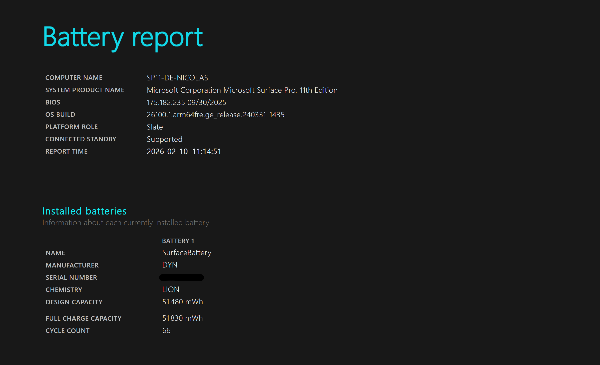

# Windows Battery Report Tool

A tool that executes the ```powercfg /batteryreport``` command, while also automatically open and delete the file when done.

## What is Windows's Battery report

Windows's Battery Report shows informations about your battery, like the battery/batteries capacities, charge cycles, mesured/estimated battery life, and more.



## How to use

Download the ```Battery report.bat``` from the source code or the releases

Execute the script.  
It should automatically open the report in your default web browser.
